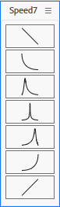

# Speed7

A seven-button Easy Ease panel for After Effects, built to be squeezed
down to almost nothing. Select keyframes, click a button, done — one click
per easing preset, no dialog, no options, no settings to remember.

*Shown at actual size. The icons are redrawn at the button's current size
rather than scaled as bitmaps, and the strip has flipped itself to a column
because the panel is taller than it is wide.*

## Why

Applying a temporal ease is two lines of ExtendScript. The actual problem
is keeping seven of them permanently within reach without giving up
timeline space for a panel you only click for half a second at a time.

So the panel is built to survive being made very small. Dock it in the
narrowest column of your workspace, or shrink the floating window to a
strip, and it stays usable:

- **The buttons have no fixed size.** They fill whatever room the panel
  has and shrink with it, down to 16 × 16 pixels each.
- **The icons are vector drawings, not images.** They are re-rendered at
  the button's current size every time the panel is resized, so the curve
  stays sharp and centred at any scale instead of turning into a blurry or
  clipped bitmap. The stroke thickness scales with them, so a tiny icon
  doesn't end up a fat blob.
- **The button strip flips between a row and a column on its own.** When
  the panel is taller than it is wide it stacks vertically, so it reads
  the same docked in a side column as floating above the timeline.

Icon and border colours are read from your After Effects UI brightness
preference at startup, so the panel matches a light or a dark theme.

## The seven buttons

Left to right — top to bottom once the strip has flipped to a column. The
curve drawn on each icon is the speed graph it applies:

1. Constant deceleration
2. Influence &nbsp;&nbsp;0% out / 100% in
3. Influence &nbsp;33% out / 100% in
4. Influence &nbsp;90% out / &nbsp;90% in
5. Influence 100% out / &nbsp;33% in
6. Influence 100% out / &nbsp;&nbsp;0% in
7. Constant acceleration

Every button only touches the **segments between selected keyframes**. A
key's incoming ease is changed only when the previous key is selected
too, its outgoing ease only when the next key is. With keys 2 and 3
selected out of 4, only the 2-3 segment changes; 1-2 and 3-4 keep their
interpolation and influence exactly as they were, linear or not. A single
selected key with no selected neighbour is left untouched.

Buttons 1 and 7 set linear interpolation, and additionally apply a 33%
influence on the side facing an adjacent selected keyframe, so a run of
selected keys eases as a group rather than key by key.

## Install

It's a dockable panel, so it goes in the ScriptUI Panels folder rather
than the plain Scripts folder. Menu commands below are in English; adapt
them to whatever language your copy of After Effects runs in.

1. Open After Effects.
2. `File > Scripts > Install ScriptUI Panel...` and pick `Speed7.jsx`.
3. Restart After Effects.
4. Open it from the bottom of the `Window` menu: `Speed7.jsx`.

You can also run it without installing, via `File > Scripts > Run Script
File`, in which case it opens as a floating palette instead of a dockable
panel.

## Notes and limitations

- Properties that can't take a Bezier ease are skipped **silently**: a
  Checkbox Control, an effect's dropdown menu, or a property group header.
  Selecting one of those alongside a Position eases the Position and
  ignores the rest. If a selection contains nothing easeable, a click does
  nothing at all and says nothing.
- Buttons 2 and 6 ask for 0% influence but send 0.1%, because After
  Effects rejects an influence of exactly zero. The difference isn't
  visible on a curve.
- The icons are drawn with the ScriptUI `Graphics` API, which repaints on
  every resize. On a very large floating window this is a little more work
  per frame than blitting a bitmap would be — invisible at the sizes the
  panel is designed for.
- Tested on After Effects 2026 (26.3) on Windows.

## Status

Vibecoded and offered without warranty — the person running it assumes
full responsibility for its use. It modifies keyframe interpolation on
whatever you have selected, and every action is a single undo step.

## License

[CC0 1.0 Universal](LICENSE). Public domain, to the extent possible under
law — copy it, change it, ship it inside your own tools, with or without
credit.
